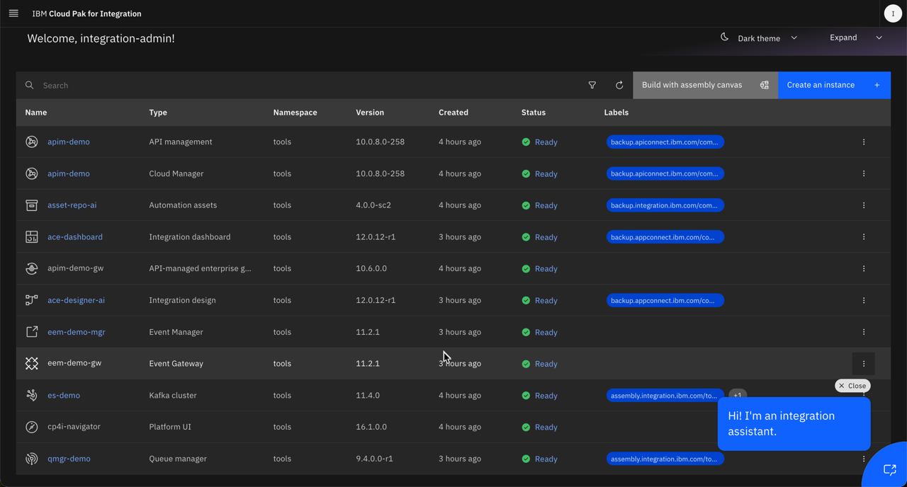
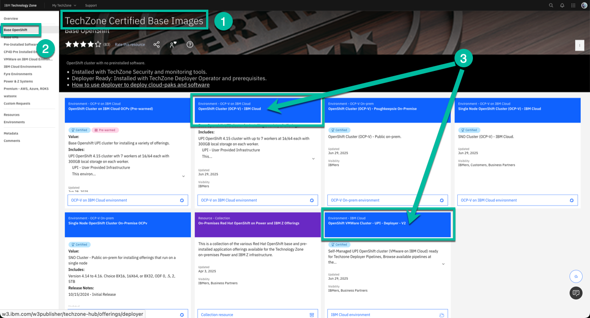
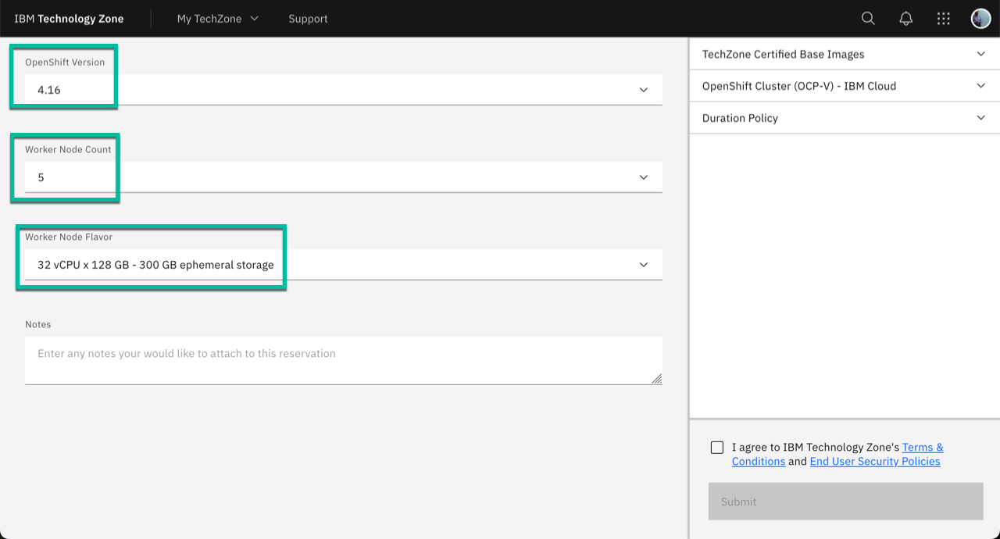
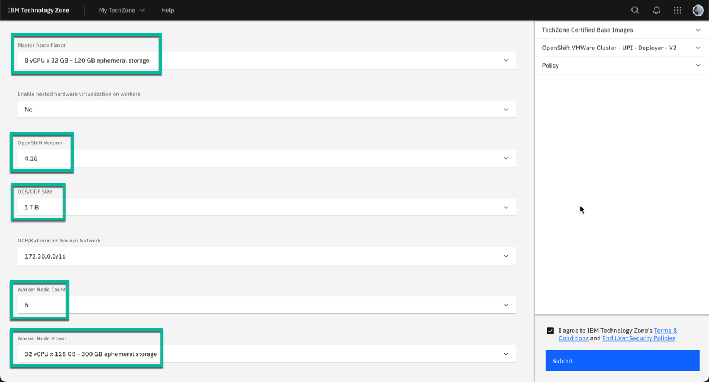
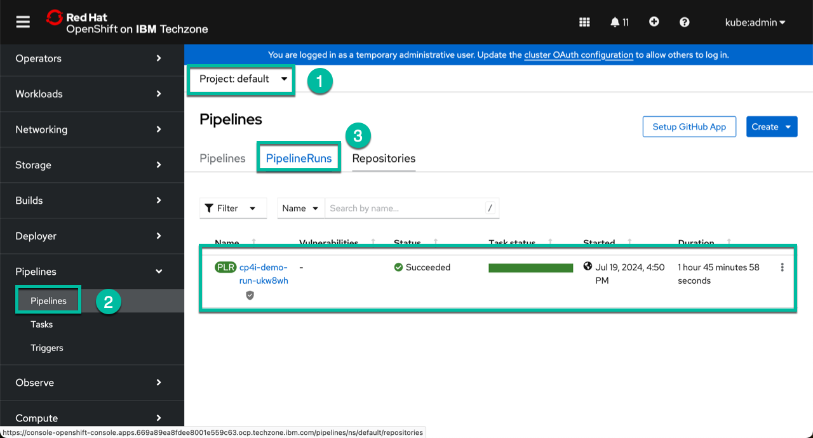
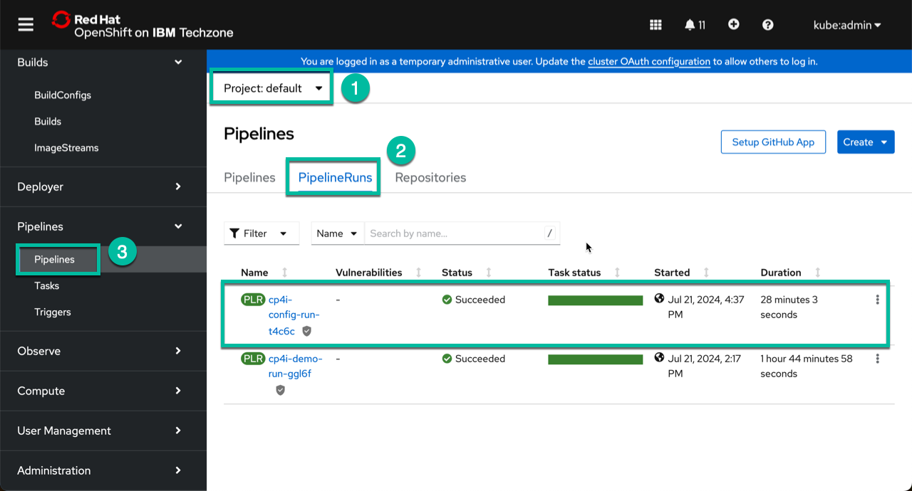

# cp4i-tz-deployer-yl

This repo is intended to simplify the process to get a full CP4I demo environment for the latest versions of CP4I (v16.1.0 for LTS and v16.1.2 for CD) based on the CP4I end-to-end demo assets.

This repo does not include the extra elements like Instana and Logging, but the core CP4I capabilities and License Service are included now.

It will get you an environment like the one below:



For these assets to work you will need an OCP cluster in TechZone using either the **OpenShift Cluster (OCP-V) - IBM Cloud** or **OpenShift VMWare Cluster - UPI - Deployer - V2** templates which are part of the *TechZone Certified Base Images* collection under *Base Openshift*. You can access the collection clicking [here](https://techzone.ibm.com/collection/tech-zone-certified-base-images/journey-base-open-shift). You can use the following image as a reference:



When making the reservation select **v4.16** for the OCP version and 5 nodes with 32 cores and 128 GB of memory to get the best results. Note you can use OCP v4.15 but I recommend you use the latest version if possible. Note that with the new OCP-V type of cluster in TechZone you do not need to select storage type because automatically provisions external ODF storage. The following images shows the recommended values for each type of cluster.

**OpenShift Cluster (OCP-V) - IBM Cloud:**


**OpenShift VMWare Cluster - UPI - Deployer - V2:**


To use this repo you need to have the `oc` command-line interface installed in your workstation alongside with the `tkn` command-line interface.

In case you do not have `tkn` already installed, use the following instructions based on your OS: [tekton cli](https://tekton.dev/docs/cli/)

After login to your cluster I suggest you do some validations before running the pipelines to make sure you cluster is fully ready.

1. Confirm the cluster has enough capacity.
    ```
    utilities/check-compute.sh
    ```
    Both vCPU and Memory must pass, otherwise you should request a new cluster with the characteristics mentioned above.
2. Confirm the minimum operators and storage classes are available in the cluster.
    ```
    utilities/check-pre-reqs.sh
    ```
    If any of the items reports a `fail` status you should contact TZ Support to investigate the issues before moving forward.

Once you confirm the cluster meets all the requirements, decide if you want to install CP4I v16.1.0 or v16.1.2 and execute the corresponding commands based on the type of cluster you have provisioned.

<details>
<summary>
OpenShift Cluster (OCP-V) - IBM Cloud
</summary>

**CP4I v16.1.2**
```
oc apply -f resources/pipeline1.yaml
tkn pipeline start cp4i-demo \
    --namespace default \
    --use-param-defaults \
    --workspace name=cp4i-ws,volumeClaimTemplateFile=resources/workspace-template.yaml \
    --pod-template resources/pod-template.yaml
```

**CP4I v16.1.0**
```
oc apply -f resources/pipeline1.yaml
tkn pipeline start cp4i-demo \
    --namespace default \
    --use-param-defaults \
    --workspace name=cp4i-ws,volumeClaimTemplateFile=resources/workspace-template.yaml \
    --pod-template resources/pod-template.yaml \
    --param CP4I_VERSION="16.1.0"
```
</details>
&nbsp; 

<details>
<summary>
OpenShift VMWare Cluster - UPI - Deployer - V2
</summary>

**CP4I v16.1.2**
```
oc apply -f resources/pipeline1.yaml
tkn pipeline start cp4i-demo \
    --namespace default \
    --use-param-defaults \
    --workspace name=cp4i-ws,volumeClaimTemplateFile=resources/workspace-template.yaml \
    --pod-template resources/pod-template.yaml \
    --param DEFAULT_SC="ocs-storagecluster-ceph-rbd" \
    --param OCP_BLOCK_STORAGE="ocs-storagecluster-ceph-rbd" \
    --param OCP_FILE_STORAGE="ocs-storagecluster-cephfs"
```

**CP4I v16.1.0**
```
oc apply -f resources/pipeline1.yaml
tkn pipeline start cp4i-demo \
    --namespace default \
    --use-param-defaults \
    --workspace name=cp4i-ws,volumeClaimTemplateFile=resources/workspace-template.yaml \
    --pod-template resources/pod-template.yaml \
    --param DEFAULT_SC="ocs-storagecluster-ceph-rbd" \
    --param OCP_BLOCK_STORAGE="ocs-storagecluster-ceph-rbd" \
    --param OCP_FILE_STORAGE="ocs-storagecluster-cephfs" \
    --param CP4I_VERSION="16.1.0"
```

</details>
&nbsp; 


You do not have to add the version parameters when using CP4I v16.1.2 because that is the default version. Now, by default the pipeline will use `KeyCloak` for EEM and EP, if you want to use **Local Security** instead, you can add the following parameter to one of the previous commands, making sure you add a `\` at the end of the last line in order to include the new line:

```
    --param EA_OIDC="false"
```

Additionally, if you need to demo License Service you can add the following parameters as well. And do not forget to add a `\` at the end of the last line in order to include the new lines:

```
    --param DEPLOY_LICENSE_SERVICE="true" \
    --param DEPLOY_LICENSE_REPORTER="true"
```

Around two hours later, you will see the following result in the OCP Console and you will be ready to roll.



The information to access CP4I and the rest of the capabilities deployed are stored in a set of configmaps in the default namespace. This is the initial list:

```
pipeline-cp4i-demo-output
pipeline-ea-demo-output
pipeline-lsr-demo-output
pipeline-mailpit-demo-output 
```

Use the OCP Console to get the corresponding values, or if you have `yq` installed in your workstation you can use the following commands instead:

```
oc get configmap/pipeline-cp4i-demo-output -n default -o yaml | yq .data
oc get configmap/pipeline-ea-demo-output -n default -o yaml | yq .data
oc get configmap/pipeline-lsr-demo-output -n default -o yaml | yq .data
oc get configmap/pipeline-mailpit-demo-output -n default -o yaml | yq .data
```

In case you do not have `yq` already installed, you can get instructions to install it in the [official yq git repo](https://github.com/mikefarah/yq). 

Note the core deployment does not include the extra demo assets like App Connect Integrations nor Event Streams topics and connector nor populate the EEM catalog nor configure the extra APIC POrg resources and the extra gateway as well as the assemblies with the declarative API and Product. If you want them to be included get the corresponding token and api key following the instructions listed [here](https://ibm.github.io/event-automation/eem/security/api-tokens/#creating-a-token) for EEM and [here](https://www.ibm.com/docs/en/api-connect/10.0.x?topic=applications-managing-platform-rest-api-keys) for APIC.


Then run the following two commands once the previous pipeline run has completed successfully. In the command I'm enabling integration between APIC and EEM using parameter *EEM_APIC_INT*, if you do not need to demo this functionality simply remove that line. The command also enables some extra WatsonX assets with parameter *EA_WATSONX*, but they rely on BAM that was deprecated recently, so even though you can deploy them, you won't be able to use them until an alternative is found, if you do not want to enable those assets remove that line.

<details>
<summary>
OpenShift Cluster (OCP-V) - IBM Cloud
</summary>

```
oc apply -f resources/pipeline2.yaml
tkn pipeline start cp4i-config \
    --namespace default \
    --use-param-defaults \
    --workspace name=cp4i-ws,volumeClaimTemplateFile=resources/workspace-template.yaml \
    --pod-template resources/pod-template.yaml \
    --param EEM_APIC_INT="true" \
    --param EA_WATSONX="true" \
    --param EEM_TOKEN=<eem-token> \
    --param APIC_API_KEY=<api-key>
```

</details>
&nbsp; 

<details>
<summary>
OpenShift VMWare Cluster - UPI - Deployer - V2
</summary>

```
oc apply -f resources/pipeline2.yaml
tkn pipeline start cp4i-config \
    --namespace default \
    --use-param-defaults \
    --workspace name=cp4i-ws,volumeClaimTemplateFile=resources/workspace-template.yaml \
    --pod-template resources/pod-template.yaml \
    --param OCP_BLOCK_STORAGE="ocs-storagecluster-ceph-rbd" \
    --param OCP_FILE_STORAGE="ocs-storagecluster-cephfs" \
    --param EEM_APIC_INT="true" \
    --param EA_WATSONX="true" \
    --param EEM_TOKEN=<eem-token> \
    --param APIC_API_KEY=<api-key>
```

</details>
&nbsp; 

After approximately one hour, you will see the following result in the OCP Console and the full CP4I demo stack including Event Automation will be ready to be used.



The second pipeline will create a few extra configmaps with the result of the pipeline execution as well as information to access APIC Portals and the data to configure the extra gateway in case you want to demo this functionality. This is the list:

```
pipeline-cp4i-config-output
pipeline-apic-demo-output
pipeline-extra-api-gtwy-demo-output
pipeline-dp-gtwy-demo-output
pipeline-qmgr-demo-output
```

And the commands to use `yq` to get the data without accessing the OCP Console are the following:

```
oc get configmap/pipeline-cp4i-config-output -n default -o yaml | yq .data
oc get configmap/pipeline-apic-demo-output -n default -o yaml | yq .data
oc get configmap/pipeline-extra-api-gtwy-demo-output -n default -o yaml | yq .data
oc get configmap/pipeline-dp-gtwy-demo-output -n default -o yaml | yq .data
oc get configmap/pipeline-qmgr-demo-output -n default -o yaml | yq .data
```

Clone and have fun. Happy demoing!
